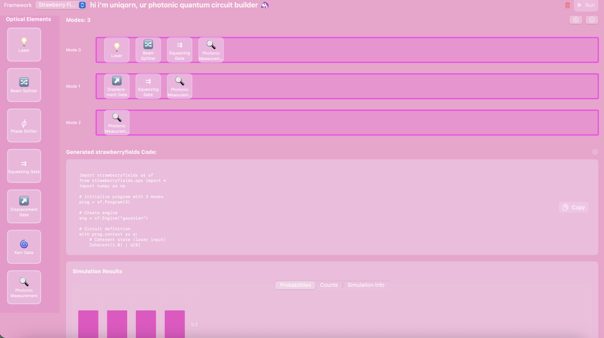
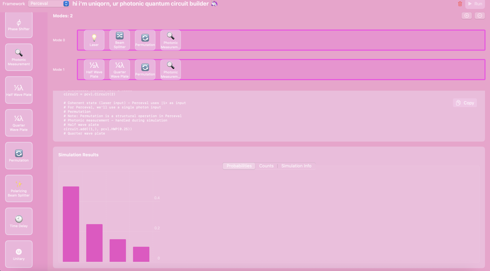

# [uniqorn]([url](https://github.com/mastermercury18/uniqorn)) 🦄

uniqorn is a macOS application that provides a visual composer for photonic quantum circuits. Users can drag and drop optical elements onto modes (wires) to design photonic quantum circuits, which are then converted into code for simulation with either Xanadu's Strawberry Fields or Quandela's Perceval frameworks.

## Features

- **Visual Circuit Design**: Intuitive drag-and-drop interface for creating photonic quantum circuits
- **Framework Toggle**: Switch between Strawberry Fields and Perceval backends
- **Optical Elements**: Supports various optical elements including:
  - Lasers (Coherent states)
  - Beam Splitters
  - Phase Shifters
  - Squeezing Gates
  - Displacement Gates
  - Kerr Gates
  - Polarizing Beam Splitters
  - Waveplates
  - Photonic Measurements
- **Dynamic Modes**: Add or remove optical modes (wires) as needed
- **Code Generation**: Automatically converts visual circuits to Python code for either Strawberry Fields or Perceval
- **Simulation Ready**: Generated code can be run with either framework for quantum optical simulations
- **Real-time Results**: Visualize simulation results with interactive charts and graphs




## Technology Stack

- **Frontend**: Swift/SwiftUI for macOS
- **Backend**: Python servers for Strawberry Fields and Perceval quantum photonics frameworks
- **Communication**: HTTP REST API between Swift frontend and Python backends
- **Architecture**: Model-View pattern with ObservableObject for state management

## Project Structure

```
uniqorn/
├── uniqorn/
│   ├── ContentView.swift          # Main view
│   ├── uniqornApp.swift        # App entry point
│   ├── OpticalElement.swift       # Optical element models
│   ├── OpticalCircuit.swift       # Circuit logic and code generation
│   ├── OpticalElementViews.swift  # UI components for elements
│   ├── CircuitView.swift          # Main circuit view
│   ├── PythonBackend.swift        # Communication with Python servers
│   ├── QuantumFramework.swift     # Framework definitions
│   ├── SimulationResultsView.swift # Results visualization
│   └── Assets.xcassets/           # App assets
├── uniqorn.xcodeproj/          # Xcode project files
├── strawberry_server.py           # Strawberry Fields HTTP server
├── perceval_server.py              # Perceval HTTP server
├── start_servers.sh               # Script to start both servers
├── kill_ports.sh                  # Script to kill server processes
├── requirements.txt               # Python dependencies
└── README.md                      # This file
```

## Supported Optical Elements

uniqorn supports a wide range of optical elements for quantum photonic circuit design. These elements are categorized based on which frameworks support them.

### Elements Supported by Both Frameworks

| Element | Symbol | Description |
|---------|--------|-------------|
| Laser | 💡 | Creates a coherent state (laser input) |
| Beam Splitter | 🔀 | Splits or combines optical paths |
| Phase Shifter | 𝜙 | Applies a phase shift to a mode |
| Photonic Measurement | 🔍 | Measures photonic states |

### Elements Supported by Strawberry Fields Only

| Element | Symbol | Description |
|---------|--------|-------------|
| Squeezing Gate | ⇉ | Applies squeezing operation |
| Displacement Gate | ↗️ | Displaces a state in phase space |
| Kerr Gate | 🌀 | Applies Kerr nonlinearity |

### Elements Supported by Perceval Only

| Element | Symbol | Description |
|---------|--------|-------------|
| Half Wave Plate | ½λ | Half-wave plate for polarization manipulation |
| Quarter Wave Plate | ¼λ | Quarter-wave plate for polarization manipulation |
| Permutation | 🔄 | Permutes modes in the circuit |
| Polarizing Beam Splitter | ✨ | Beam splitter that acts on polarization |
| Time Delay | 🕙 | Applies a time delay to a mode |
| Unitary | 🅤 | Arbitrary unitary transformation |


## Setting Up Backend Servers

uniqorn requires Python backend servers to run simulations. Follow these steps to set up:

### Prerequisites
- Python 3.8 or later
- Required Python packages (install with `pip install -r requirements.txt`):
  - strawberryfields
  - perceval-quandela
  - numpy
  - scipy

### Starting the Servers

1. **Automatic Method** (recommended):
   ```bash
   cd uniqorn/uniqorn
   ./start_servers.sh
   ```

2. **Manual Method**:
   ```bash
   # Terminal 1: Start Strawberry Fields server
   cd uniqorn/uniqorn
   python3 strawberry_server.py 8080
   
   # Terminal 2: Start Perceval server
   cd uniqorn/uniqorn
   python3 perceval_server.py 8081
   ```

### Stopping the Servers

- **Automatic Method**: 
  ```bash
  ./kill_ports.sh
  ```
  
- **Manual Method**: Use Ctrl+C in each terminal, or:
  ```bash
  pkill -f "strawberry_server.py"
  pkill -f "perceval_server.py"
  ```


## Requirements

- Xcode 16.4 or later
- macOS 14.0 or later for development
- Python 3.8 or later with dependencies listed in `requirements.txt`


## License

This project is licensed under the MIT License - see the LICENSE file for details.

## Acknowledgments

- Xanadu for the Strawberry Fields framework
- Quandela for the Perceval framework
- Inspired by IBM's Quantum Circuit Composer
